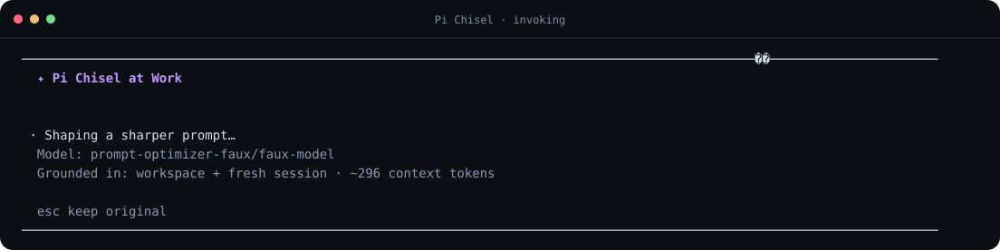
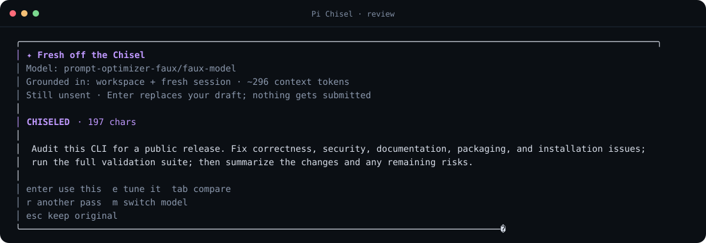
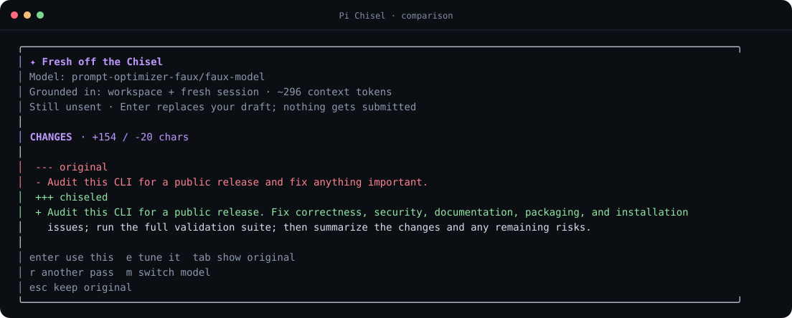

# Pi Chisel

Pi Chisel turns rough drafts into clear, send-ready prompts without submitting them. Your original stays in the editor until you review the rewrite and explicitly choose what to do next.

- **Review before replacing** — use the rewrite, edit it, compare versions, retry, switch models, or keep the original.
- **Nothing is auto-submitted** — accepting a rewrite only updates the editor.
- **Grounded when useful** — optionally includes bounded workspace and recent-session context.
- **Private by design** — drafts and responses aren't persisted or added to the conversation transcript.
- **Provider-independent** — follows the current chat model or uses a separately pinned optimizer model.

Pi Chisel's native Pi package is the primary integration. A separate OMP integration is supported for users of that host.

## See it in action

Invoke Pi Chisel while the original draft remains untouched:



Review the rewritten draft and choose the next action:



Compare the original and rewritten versions before replacing anything:



The screenshots use a deterministic faux provider and synthetic content only.

## Install

### Pi

The native Pi package is verified against `@earendil-works/pi-coding-agent` **0.84.1**. Confirm `pi --version` reports `0.84.1` and configure a model through `/login` or `/model`.

Install the pinned release from GitHub:

```bash
pi install git:github.com/feveromo/pi-chisel@pi-v0.1.0
```

Run `/reload` in an open Pi session, or start a new one, then verify the package:

```bash
pi list
```

Try Pi Chisel for one session without installing it:

```bash
pi -e git:github.com/feveromo/pi-chisel@pi-v0.1.0
```

### OMP integration

The secondary OMP integration is verified against OMP **17.2.11** and its canonical `@oh-my-pi/*` APIs. Later OMP versions may work but aren't part of this release's tested compatibility boundary. Configure a model through `/login` or `/model`, then install:

```bash
omp plugin install github:feveromo/pi-chisel
```

Run `/reload` in an open OMP session, or start a new one, then verify the plugin:

```bash
omp plugin list
```

From a main-branch checkout, run the OMP integration directly without installing it:

```bash
omp --no-extensions -e ./src/index.ts
```

Uninstall it with:

```bash
omp plugin uninstall pi-chisel
```

## Use

1. Type a draft in the editor.
2. Press **Ctrl+Shift+K**.
3. Review the result **Fresh off the Chisel**:
   - **Enter** or **A** — replace the draft without submitting it.
   - **E** — edit the complete rewrite.
   - **Tab** or **V** — cycle rewrite, changes, and original views.
   - **D** / **O** — jump to changes or the original.
   - **R** — run another pass with an additional request.
   - **M** — choose the optimizer model.
   - **Escape** or **Q** — keep the original.
4. After replacement, press **U** to restore the previous draft, or close the confirmation to keep the rewrite.
5. Submit normally when you're ready.

Commands:

- `/prompt-optimize <draft>` — optimize an explicit draft. Because slash commands occupy the editor and may trim the outer command line, use the shortcut when byte-for-byte preservation matters.
- `/prompt-optimize-model` — choose the optimizer model.
- `/prompt-optimize-settings` — configure context, budget, intensity, preview, model, and shortcut.
- `/prompt-optimize-restore` — restore the most recently replaced draft when it's still available in memory.

## Models and settings

Pi Chisel follows the current chat model by default. Pinning another model affects only the optimizer; it doesn't change the conversation model. If the pinned model becomes unavailable, Pi Chisel reports the fallback and uses the current model for that pass.

The Pi integration uses Pi's registered provider and resolved authentication, including OAuth credentials, provider headers, provider-scoped environment, and credential-specific base URLs. Its settings are stored at:

```text
~/.pi/agent/prompt-optimizer.json
```

The OMP integration uses OMP's authenticated model registry, credential resolver, provider headers, and credential-specific base URL. Its settings are stored separately at:

```text
~/.omp/agent/prompt-optimizer.json
```

Run `/prompt-optimize-settings` to configure either integration. Settings are written atomically with mode `0600` and contain model IDs and UI preferences, never credentials or drafts.

Default configuration:

```json
{
  "version": 1,
  "model": null,
  "contextMode": "auto",
  "contextTokenBudget": 1800,
  "intensity": "standard",
  "shortcut": "ctrl+shift+k",
  "previewMode": "optimized"
}
```

### Context modes

- `auto` — includes a bounded workspace snapshot and adapts recent-session context to the draft.
- `recent` — uses the workspace snapshot plus as much recent-session context as fits the configured budget.
- `none` — sends only the draft and optimizer instruction.

Workspace context can include the project name, relative working directory, branch, manifest summary, README overview, top-level landmarks, and in-project guidance already loaded by the host. The Pi integration honors Pi's project-trust boundary and doesn't inspect untrusted project files. The OMP integration doesn't add absolute paths, excludes guidance outside the project root, and doesn't follow metadata-file symlinks.

Session context includes recent user and assistant text plus compaction and branch summaries. It excludes thinking, tool calls and results, hidden entries, extension metadata, telemetry, and diagnostics. The exact draft and output allowance always take priority when context must shrink.

OMP 17.2.11 doesn't expose Pi's project-trust predicate to extensions. Use `none` in OMP when Pi Chisel must not inspect or send workspace or session context.

### Intensity

- `light` — stays close to the original wording, structure, and length.
- `standard` — improves clarity, structure, specificity, and ordering.
- `strong` — reconstructs more aggressively while preserving intent and constraints.

The optimizer instruction lives in [`src/optimizer-instruction.ts`](src/optimizer-instruction.ts).

## Privacy and safety

Every pass sends the draft to the selected model provider. `auto` and `recent` also send the bounded context described above; `none` sends only the draft and optimizer instruction. Provider-side retention is governed by the selected provider and account.

Pi Chisel doesn't persist drafts, context, responses, credentials, or telemetry. Its provider request uses a fresh side-channel session ID, no tools, and no prompt caching, and it doesn't enter the conversation transcript or main agent loop.

Additional safeguards:

- Escape aborts the active request immediately; a 120-second timeout does the same.
- Empty, unchanged, malformed, truncated, errored, unauthenticated, rate-limited, and network-failed responses never replace the draft.
- Dynamic terminal content is sanitized before rendering.
- Workspace and session context are explicitly marked as untrusted evidence.
- Concurrent invocations are rejected.
- Replacement and restore both verify that the editor still contains the expected text before writing.
- Shutdown and reload abort active work and dismiss temporary UI.

Pi 0.84.1 and OMP 17.2.11 expose the whole editor buffer but no selection or cursor-range operation, so both integrations optimize the complete draft. The default **Ctrl+Shift+K** binding is unclaimed by both verified host versions, but a terminal or desktop environment may intercept it; change it through `/prompt-optimize-settings` if needed.

## Develop and test

The integrations have separate runtime branches because they compile against different host APIs.

### Pi checkout

```bash
git clone --branch pi https://github.com/feveromo/pi-chisel.git pi-chisel-pi
cd pi-chisel-pi
npm ci --ignore-scripts --legacy-peer-deps
pi install .
npm run validate
```

The Pi validation suite runs formatting and lint checks, TypeScript, unit tests, an isolated Pi PTY smoke test, and `npm run smoke:configured` against the linked checkout.

### OMP checkout

```bash
git clone https://github.com/feveromo/pi-chisel.git
cd pi-chisel
npm ci --ignore-scripts
omp plugin link .
npm run validate
npm run smoke:configured
```

The OMP validation suite also runs a production dependency audit, package inspection, an OMP 17.2.11 PTY smoke test, and a clean packaged-install smoke test.

Implementation details and verified host-specific hooks are documented in [`docs/architecture.md`](docs/architecture.md) on each runtime branch. Report vulnerabilities through [`SECURITY.md`](SECURITY.md). Pi Chisel is available under the [MIT License](LICENSE).
