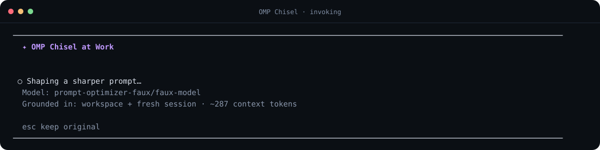
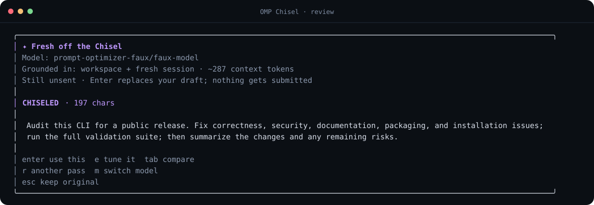

# OMP Chisel

OMP Chisel is an Oh My Pi plugin that rewrites the unsent prompt in the editor without submitting it. Press **Ctrl+Shift+K** to put **OMP Chisel at Work**, then inspect the result **Fresh off the Chisel** before you use it, tune it, compare versions, take another pass, or keep the original.

This release supports OMP **17.2.11** and its canonical `@oh-my-pi/*` APIs. It does not patch OMP, start a daemon, use the clipboard, add persistent UI, or write optimizer traffic into the session transcript.

## Requirements

- OMP `17.2.11` (`omp --version` should print `omp/17.2.11`). Later OMP releases may work, but they are outside this release's verified compatibility boundary.
- At least one model configured through OMP's normal `/login` or `/model` flow.

## Install

Install the plugin directly from GitHub:

```bash
omp plugin install github:feveromo/pi-chisel
```

Run `/reload` in an open OMP session, or start a new one. Confirm the plugin is enabled:

```bash
omp plugin list
```

To develop from a checkout instead, link the working tree:

```bash
git clone https://github.com/feveromo/pi-chisel.git
cd pi-chisel
npm ci --ignore-scripts
omp plugin link .
```

For a one-off test from the checkout without installing it:

```bash
omp --no-extensions -e ./src/index.ts
```

Remove the plugin with `omp plugin uninstall pi-chisel`.

## Use it

1. Type a draft in OMP's normal editor.
2. Press **Ctrl+Shift+K**. The draft remains in the editor while **OMP Chisel at Work** shapes one new version.
3. Review the result **Fresh off the Chisel**. Using it only replaces the draft; it never submits:
   - **Enter** or **A** uses the chiseled version and replaces the draft.
   - **E** opens the complete chiseled text in OMP's multiline editor for tuning.
   - **Tab** or **V** cycles chiseled, color-highlighted changes, and original views. **D** jumps to changes; **O** jumps to original.
   - **Up/Down**, **Page Up/Page Down**, **Home**, and **End** navigate long reviews.
   - **R** takes another pass with one new request.
   - **M** opens Chisel's model picker.
   - **Escape** or **Q** keeps the original untouched.
4. After replacement, press **U** in the **Chiseled draft ready** confirmation to restore the previous draft, or press **Enter/Escape** to keep the chiseled draft.
5. Submit normally only when you are ready.

The fallback command is:

```text
/prompt-optimize <draft>
```

OMP slash commands occupy the editor themselves, so the command form takes the draft as its argument. Use the shortcut when preserving the currently typed draft byte-for-byte matters; OMP trims the outer command line before dispatching slash-command arguments.

Other commands:

- `/prompt-optimize-model` opens Chisel's searchable model picker.
- `/prompt-optimize-settings` opens native settings for context, budget, intensity, preview, model, and shortcut.
- `/prompt-optimize-restore` restores the last replacement when the previous draft is still available in this extension runtime. The immediate **U** action is the normal restore path because entering a slash command replaces editor text.

## Workflow preview

Press the shortcut to start a side-channel rewrite while the original remains in OMP's editor:



Review the rewritten draft and choose whether to use it, tune it, run another pass, switch models, compare versions, or keep the original:



The comparison view keeps both versions visible before anything replaces the editor draft:


These screenshots come from the bundled deterministic faux provider and contain synthetic demo content only.

## Model selection

The picker reads OMP's live authenticated model snapshot and shows provider, model ID, and display name. Its first entry is **Use current chat model**.

Choosing a concrete model pins only the optimizer; it does not change the active conversation model. The selection is stored in:

```text
~/.omp/agent/prompt-optimizer.json
```

If a pin disappears or loses authentication, Chisel says what happened and uses the current chat model for that pass. The missing pin stays configured until you explicitly replace it.

The request uses OMP's model registry, credential resolver, provider headers, and credential-specific base URL. OAuth-backed models such as OpenAI Codex therefore use the same authentication configured in OMP.

## Settings

Run `/prompt-optimize-settings`:

- Use **Up/Down** and **Enter** to change context mode, token budget, editing intensity, and the initial review view.
- Press **M** to choose the optimizer model.
- Press **K** to enter a new shortcut. OMP's resolved keybindings are checked first; a built-in conflict is rejected. OMP reloads after saving a new shortcut.
- Press **Escape** to save and close.

Default configuration:

```json
{
  "version": 1,
  "model": null,
  "contextMode": "auto",
  "contextTokenBudget": 1800,
  "intensity": "standard",
  "shortcut": "ctrl+shift+k",
  "previewMode": "optimized"
}
```

Writes are atomic and mode `0600`. The file contains model IDs and UI preferences only, never credentials.

### Grounding context

- `auto` always includes a bounded workspace snapshot, then adds recent active-branch evidence when available. Brief or referential drafts receive the expanded session budget; developed, self-contained drafts receive a smaller ambient slice so unrelated history does not dominate.
- `recent` includes the workspace snapshot plus as much recent active-branch evidence as fits the configured budget.
- `none` is the explicit draft-only privacy mode. It disables both workspace and session grounding.

The workspace snapshot uses OMP's current working directory. It can include the project name and relative working directory, branch, a package or language manifest, README overview, top-level landmarks, and bounded in-project guidance already loaded into OMP's system prompt. The generated workspace identity does not add absolute paths, and guidance files outside the detected project root are excluded. OMP 17.2.11 does not expose the former Pi project-trust predicate to extensions, so use context mode `none` when Chisel must not inspect or send workspace evidence.

Session grounding reads OMP's active branch, retaining recent user and assistant text plus compaction and branch summaries. Thinking blocks, tool calls, tool results, hidden custom entries, extension metadata, telemetry, and model diagnostics remain excluded. Oversized items retain both their beginning and end around an omission marker, and per-item caps keep one long assistant response from crowding out the preceding request.

OMP's token estimator enforces one combined grounding budget. The exact draft and output allowance take priority and are never truncated; workspace and session evidence shrink first. A fresh session still receives workspace grounding, which is why the review says `Grounded in: workspace + fresh session`.

### Intensity

- `light` stays close to wording, structure, and length.
- `standard` improves clarity, structure, specificity, and ordering.
- `strong` reconstructs more aggressively while preserving intent and concrete constraints.

The reusable optimizer instruction lives in [`src/optimizer-instruction.ts`](src/optimizer-instruction.ts).

## Privacy and data handling

Every optimization sends the unsent draft to the selected model provider. With `auto` or `recent`, the request also contains the bounded workspace and session evidence described above; `none` sends the draft and optimizer instruction only. A pinned optimizer model can use a different provider from the active chat model, so choose it with the same data-handling requirements you apply to the draft itself.

Chisel stores only model IDs and UI preferences in `~/.omp/agent/prompt-optimizer.json`. It does not store drafts, grounding evidence, responses, credentials, or telemetry, and its side-channel request does not enter OMP's session transcript. Provider-side retention remains governed by the selected provider and account.

## Safety behavior

- Escape aborts the active provider stream and closes the loader immediately.
- A 120-second timeout aborts the request and leaves the draft untouched.
- Empty, unchanged at standard or strong intensity, malformed, truncated, errored, unauthenticated, rate-limited, and network-failed responses never reach the editor.
- Prompt previews and dynamic provider/error labels neutralize terminal control characters before rendering.
- Workspace and session sections are marked as untrusted evidence. Instructions inside those sections cannot override the editing task.
- A second invocation is ignored while one is active.
- Before replacement, the extension compares the current editor text with the captured draft. If another actor changed it, OMP asks whether to replace it, open a merge editor, or cancel.
- Restore performs the same comparison and never silently overwrites edits made after replacement.
- `session_shutdown` aborts active work and dismisses the overlay during quit, reload, session switch, fork, or clone.
- The provider call uses a fresh side-channel session ID, no tools, and no prompt caching. It never calls `sendMessage`, appends a session entry, or enters the main agent loop.

## Known OMP and terminal limitations

- OMP 17.2.11 exposes whole-editor get/set methods but no composer selection or cursor-range API. Chisel therefore optimizes the whole draft; it does not guess at terminal selection state or wrap the editor.
- The default is **Ctrl+Shift+K**, which is unclaimed by OMP 17.2.11. Terminals and desktop environments can still intercept shortcuts; use `/prompt-optimize-settings` to choose another binding if needed.
- Restore history is intentionally in memory. Persisting draft contents in global configuration or session metadata would create an unnecessary privacy and transcript footprint.
- Grounding evidence is sent only to the selected optimizer model and never enters OMP's transcript. Use context mode `none` when a draft should leave the editor without workspace or session evidence.
- The picker uses OMP's current authenticated registry snapshot. Use OMP's `/login` or `/model` flow first when a provider has not been configured.

## Develop and test

```bash
npm ci --ignore-scripts
npm run validate
```

`npm run validate` runs formatting and lint checks, TypeScript, unit tests, a production dependency audit, a package dry-run, the supported OMP 17.2.11 PTY smoke, and a clean packaged-install smoke in a temporary OMP home. `npm test` covers adaptive grounding, workspace extraction, active-branch context, short-draft request policy, terminal sanitization, and the provider boundary.

After linking the checkout on a development machine, `npm run smoke:configured` additionally verifies that the active OMP configuration resolves `pi-chisel` to this working tree and repeats the PTY flow with configured extensions loaded.

See [`docs/architecture.md`](docs/architecture.md) for the verified OMP hooks and source references. Security reports should follow [`SECURITY.md`](SECURITY.md); the project is available under the [`MIT License`](LICENSE).
