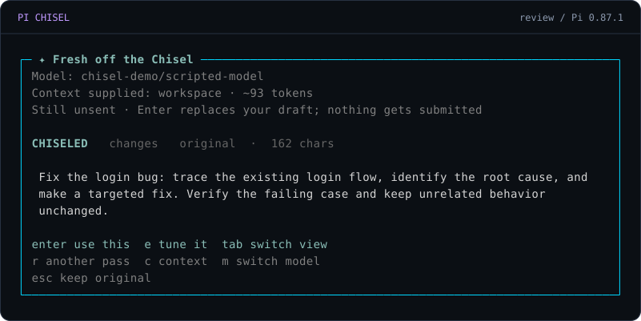
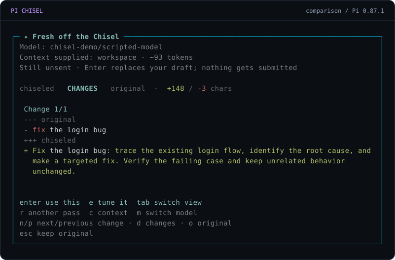
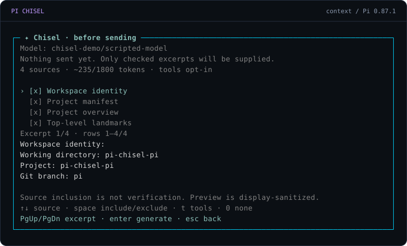
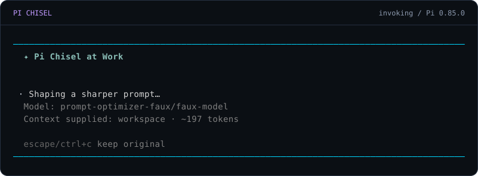

# Pi Chisel

Pi Chisel turns rough drafts into clear, send-ready prompts without submitting them. Your original stays in the editor until you review the rewrite and explicitly choose what to do next.

- **Review before replacing** — use the rewrite, edit it, compare versions, retry, switch models, or keep the original.
- **Nothing is auto-submitted** — accepting a rewrite only updates the editor.
- **More useful, still yours** — Strong builds out rough ideas with relevant detail while preserving your goal, voice, uncertainty, and explicit limits.
- **Context you control** — intent-aware workspace/session excerpts, optional pre-send inspection, and explicitly selected tool evidence.
- **Private by design** — drafts and responses aren't persisted or added to the conversation transcript.
- **Provider-independent** — follows the current chat model or uses a separately pinned optimizer model.

Pi Chisel's native Pi package is the primary integration. A separate OMP integration is supported for users of that host.

## See it in action

Start with `fix the login bug`. Review a fuller prompt before it touches your editor:



<details>
<summary>Compare changes, inspect context, and cancel generation</summary>

See exactly what changed, with the original still available:



Optionally inspect and exclude bounded sources **before sending**:



Cancel while Chisel works; the original stays untouched:



</details>

Captured from native Pi **0.85.0** using a deterministic faux provider and synthetic prompts. These show the real UI, not measured model quality. [Reproduce the captures](docs/screenshots.md).

## Install

### Pi

The native Pi package targets `@earendil-works/pi-coding-agent` **0.84.1**, with TUI smoke tests on **0.84.1** and **0.85.0**. Configure a model through `/login` or `/model`.

Install the current native integration from its runtime branch:

```bash
pi install git:github.com/feveromo/pi-chisel@pi
```

Run `/reload` in an open Pi session, or start a new one, then verify the package:

```bash
pi list
```

Try Pi Chisel for one session without installing it:

```bash
pi -e git:github.com/feveromo/pi-chisel@pi
```

The older pinned release remains available as `@pi-v0.1.0`; it does not contain the improvements documented here.

### OMP integration

The secondary OMP integration is verified against OMP **17.2.11** and its canonical `@oh-my-pi/*` APIs. Later OMP versions may work but aren't part of this release's tested compatibility boundary. Configure a model through `/login` or `/model`, then install:

```bash
omp plugin install github:feveromo/pi-chisel
```

Run `/reload` in an open OMP session, or start a new one, then verify the plugin:

```bash
omp plugin list
```

From a main-branch checkout, run the OMP integration directly without installing it:

```bash
omp --no-extensions -e ./src/index.ts
```

Uninstall it with:

```bash
omp plugin uninstall pi-chisel
```

## Use

1. Type a draft in the editor.
2. Press **Ctrl+Shift+K**.
3. Review the result **Fresh off the Chisel**:
   - **Enter** or **A** — replace the draft without submitting it.
   - **E** — edit the complete rewrite.
   - **Tab** or **V** — cycle rewrite, changes, and original views.
   - **D** / **O** — jump to focused changes or the original; **N/P** (or **]/[**) move between changes.
   - **C** — inspect context, exclude sources, optionally select tool excerpts, and regenerate.
   - **R** — steer another pass with feedback (blank means rephrase; Escape returns without a request).
   - **B** — return to the previous candidate after a successful retry or manual edit.
   - **M** — choose the optimizer model.
   - **Escape** or **Q** — keep the original.
4. After replacement, press **U** to restore the previous draft, or close the confirmation to keep the rewrite.
5. Submit normally when you're ready.

Commands:

- `/prompt-optimize <draft>` — optimize an explicit draft. Because slash commands occupy the editor and may trim the outer command line, use the shortcut when byte-for-byte preservation matters.
- `/prompt-optimize-context <draft>` — inspect the exact bounded context before the first provider request. For shortcut-based preflight, enable **Inspect before sending** in settings.
- `/prompt-optimize-model` — choose the optimizer model.
- `/prompt-optimize-settings` — configure context, budget, intensity, preview, model, and shortcut.
- `/prompt-optimize-restore` — restore the most recently replaced draft when it's still available in memory.

## Models and settings

Pi Chisel follows the current chat model by default. Pinning another model affects only the optimizer; it doesn't change the conversation model. If the pinned model becomes unavailable, Pi Chisel reports the fallback and uses the current model for that pass.

The Pi integration uses Pi's registered provider and resolved authentication, including OAuth credentials, provider headers, provider-scoped environment, and credential-specific base URLs. Its settings are stored at:

```text
~/.pi/agent/prompt-optimizer.json
```

The OMP integration uses OMP's authenticated model registry, credential resolver, provider headers, and credential-specific base URL. Its settings are stored separately at:

```text
~/.omp/agent/prompt-optimizer.json
```

Run `/prompt-optimize-settings` to configure either integration. Settings are written atomically with mode `0600` and contain model IDs and UI preferences, never credentials or drafts.

Default configuration:

```json
{
  "version": 1,
  "model": null,
  "contextMode": "auto",
  "contextTokenBudget": 1800,
  "intensity": "standard",
  "shortcut": "ctrl+shift+k",
  "previewMode": "optimized",
  "inspectContext": false
}
```

### Context modes

- `auto` — keeps workspace identity, favors relevant project/session references, and protects user instructions ahead of assistant commentary. Explicit backward references receive more history; brevity alone does not.
- `recent` — considers recent dialogue and workspace evidence without the relevance filter, still prioritizing user intent within the budget.
- `none` — omits all reference evidence. Revisions still include the original, candidate, and feedback.

Workspace context can include the project name, relative working directory, branch, manifest summary, README overview, top-level landmarks, and in-project guidance already loaded by the host. Pi honors its project-trust boundary and doesn't inspect untrusted project files. Neither integration adds absolute workspace identity paths, includes guidance outside the project root, or follows metadata-file symlinks. Source contents can themselves contain paths or sensitive material: this is not a general redactor.

Session selection favors explicit references and user turns, retaining the user instruction associated with a matching assistant reply. It labels summaries as lossy evidence, keeps selected items chronological, and prioritizes complete constraint-bearing sentences/lines when excerpts must shrink. Thinking, hidden entries, extension metadata, telemetry, and diagnostics remain excluded. Tool traffic is excluded by default; see the opt-in below. The exact original, revision candidate/feedback, and output allowance take priority over context.

OMP 17.2.11 doesn't expose Pi's project-trust predicate to extensions. Use `none` in OMP when Pi Chisel must not inspect or send workspace or session context.

### Inspect context and select tool evidence

The default shortcut still generates immediately. Enable `inspectContext` or use `/prompt-optimize-context <draft>` when you want approval **before transmission**. Cancelling that initial inspector makes no provider request. **C** during review changes the *next* request; it cannot unsend earlier ones.

The inspector shows eligible source labels and bounded excerpts, with terminal controls sanitized for display; only checked sources are queued. During review, **supplied** marks the sources actually sent for that candidate, independently of next-pass checkboxes. These are **sources supplied**, not verified facts or model explanations. Use **↑↓** to select a source, **Space** to include/exclude it, **PgUp/PgDn** or **Home/End** to read the excerpt, **0** for draft-only, and **Enter** to generate. **Escape** discards inspector changes and returns. Excluding sources does not silently pull in replacements.

**T** jumps to optional tool excerpts. All start unchecked. Only paired completed results from `bash`, `read`, `grep`, `find`, `ls`, `edit`, and `write` are eligible, taken from the last 64 session entries. Up to eight bounded candidates are offered; select at most three / 512 tokens total, within the existing overall context budget. Results show their source, command/path when available, historical status, and omission markers. Unknown tools, unpaired results, arbitrary argument/detail objects, and recognizable credential-file targets are excluded. This is not exhaustive secret detection: inspect excerpts before opting in. Chisel never runs tools itself.

Selections and exclusions last only for the current invocation, including retries. A failure does not re-enable excluded sources. Source text is frozen for the invocation; if a different model or a longer revision leaves less room, Chisel asks you to approve the remaining sources before sending. `none` disables workspace, session, and tool evidence, including the tool candidate list.

### Another pass and already-good drafts

Another pass uses the exact original, the current candidate, and your feedback. The native multiline editor shows its submit key: **Enter** in Pi, **Ctrl+Enter/Ctrl+Q** in OMP. The original remains the intent anchor; only explicit feedback authorizes changing it. Failed/cancelled retries return to the current candidate. **B** swaps between the two most recent candidates; there is no persistent revision history. Review view/scroll position survives opening other dialogs. The editor stays untouched until acceptance.

If a model returns the original unchanged at any intensity, review shows **ALREADY GOOD**. Accepting it is a no-op, not an error. The review can open on `optimized`, `original`, or `diff`.

### Intensity

- `light` — clean up wording and grammar, staying close to the original.
- `standard` — clarify and organize the request, adding modest detail where needed.
- `strong` — build out a rough idea into a substantially more useful prompt with relevant context and sensible supporting detail—not just a copyedit.

For example, Strong can turn `fix the login bug` into:

> Fix the login bug: trace the existing login flow, identify the root cause, and make a targeted fix. Verify the failing case and keep unrelated behavior unchanged.

This is an illustrative target, not a promised model output. Supporting steps can strengthen the same goal; a repair need not become an audit, and a question must not become implementation. Every intensity preserves uncertainty, conditions, exclusions, explicit length limits, literal text, and recognizable personality. Strong need not preserve the draft's original brevity or lack of detail, but “keep it brief” and “nothing else” still win. Already-effective prompts can stay unchanged. These are editorial instructions, not a mathematical guarantee of model fidelity: review still matters.

The optimizer instruction lives in [`src/optimizer-instruction.ts`](src/optimizer-instruction.ts).

## Privacy and safety

Every generated pass sends the draft to the selected model provider. `auto` and `recent` also send the selected bounded context described above; tool excerpts require explicit opt-in. Revisions additionally send the current candidate and editing feedback. `none` excludes all reference evidence, not those user-controlled revision inputs. Provider-side retention is governed by the selected provider and account.

Pi Chisel doesn't persist drafts, context, responses, credentials, or telemetry. Its provider request uses a fresh side-channel session ID, no tools, and no prompt caching, and it doesn't enter the conversation transcript or main agent loop.

Additional safeguards:

- Escape aborts the active request immediately; a 120-second timeout does the same.
- Empty, malformed, truncated, errored, unauthenticated, rate-limited, and network-failed responses never replace the draft. Unchanged output is a valid no-op.
- Dynamic terminal content is sanitized before rendering.
- Workspace and session context are explicitly marked as untrusted evidence.
- Concurrent invocations are rejected.
- Replacement and restore both verify that the editor still contains the expected text before writing.
- Shutdown and reload abort active work and dismiss temporary UI.

Pi 0.84.1 and OMP 17.2.11 expose the whole editor buffer but no selection or cursor-range operation, so both integrations optimize the complete draft. The default **Ctrl+Shift+K** binding is unclaimed by both verified host versions, but a terminal or desktop environment may intercept it; change it through `/prompt-optimize-settings` if needed.

## Develop and test

The integrations have separate runtime branches because they compile against different host APIs.

### Pi checkout

```bash
git clone --branch pi https://github.com/feveromo/pi-chisel.git pi-chisel-pi
cd pi-chisel-pi
npm ci --ignore-scripts --legacy-peer-deps
pi install .
npm run validate
```

The Pi validation suite runs formatting and lint checks, TypeScript, unit tests, an isolated Pi PTY smoke test, and `npm run smoke:configured` against the linked checkout.

### OMP checkout

```bash
git clone https://github.com/feveromo/pi-chisel.git
cd pi-chisel
npm ci --ignore-scripts
omp plugin link .
npm run validate
npm run smoke:configured
```

The OMP validation suite also runs a production dependency audit, package inspection, an OMP 17.2.11 PTY smoke test, and a clean packaged-install smoke test.

The regression suite covers context selection, opt-in/exclusion, provider request boundaries, feedback cancellation, retry recovery, candidate history, no-op acceptance, and editor/shutdown races. Both PTY suites exercise preflight without transmission, context exclusion, feedback, failed/cancelled retries, candidate recovery, and review-before-replacement/no automatic submission. Twenty-five synthetic good/bad editorial examples and a human-review rubric are in [`docs/editorial-quality.md`](docs/editorial-quality.md). Deterministic tests are not live-model quality scores.

Implementation details and verified host-specific hooks are documented in [`docs/architecture.md`](docs/architecture.md) on each runtime branch. Report vulnerabilities through [`SECURITY.md`](SECURITY.md). Pi Chisel is available under the [MIT License](LICENSE).
